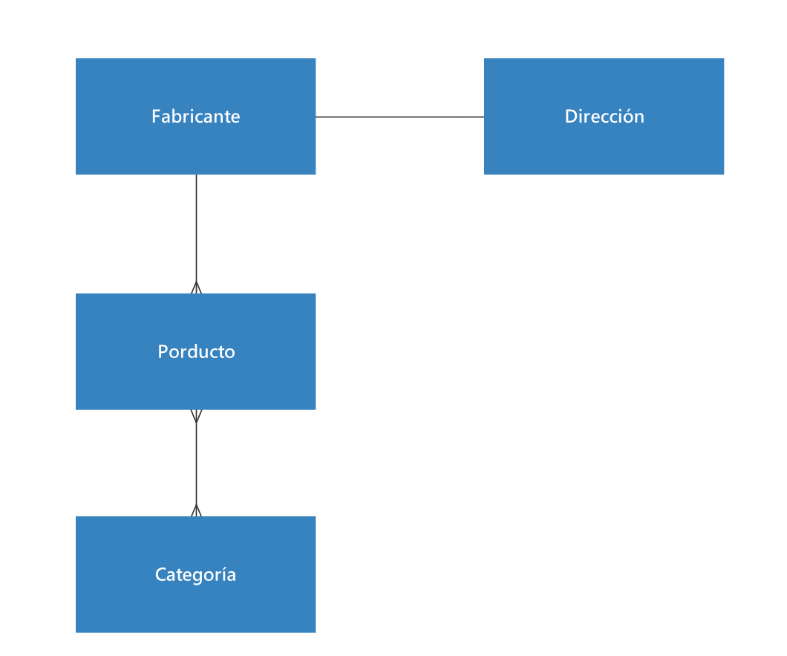

# API REST con Spring Boot + MongoDB

## Modelo conceptual del negocio

Las Colecciones MongoDB están referenciadas entre si de la siguiente manera:

<div style="text-align: center; margin: 20px; width: 100%">
     
</div>
Los cuales están compuestos por las siguientes propiedades:

```
Fabricante: {
    id: String,
    nombre: String,
    direccionId: String,
    productos: List<Productos>
}

Producto: {
    id: String,
    nombre: String,
    categorias: List<Categoria>,
    fabricanteId: String
}

Categoria: {
    id: String,
    nombre: String,
    productos: List<Producto>
}

Direccion: {
    id: String,
    calle: String,
    numeroEstablecimiento: Integer,
    entreCalles: String,
    municipio: String,
    estado: String,
    pais: String,
    ZIP: Integer
}
```

## API expuesta por Spring Data Rest

```
{
    "_links": {
        "categoria": {
            "href": "http://localhost:8080/categorias{?page,size,sort}",
            "templated": true
        },
        "producto": {
            "href": "http://localhost:8080/productos{?page,size,sort}",
            "templated": true
        },
        "direccion": {
            "href": "http://localhost:8080/direcciones{?page,size,sort}",
            "templated": true
        },
        "fabricante": {
            "href": "http://localhost:8080/fabricantes{?page,size,sort}",
            "templated": true
        },
        "profile": {
            "href": "http://localhost:8080/profile"
        }
    }
}
```

## API expuesta por Spring MVC

```
"http://localhost:8080/producto"

"http://localhost:8080/fabricante"
```
